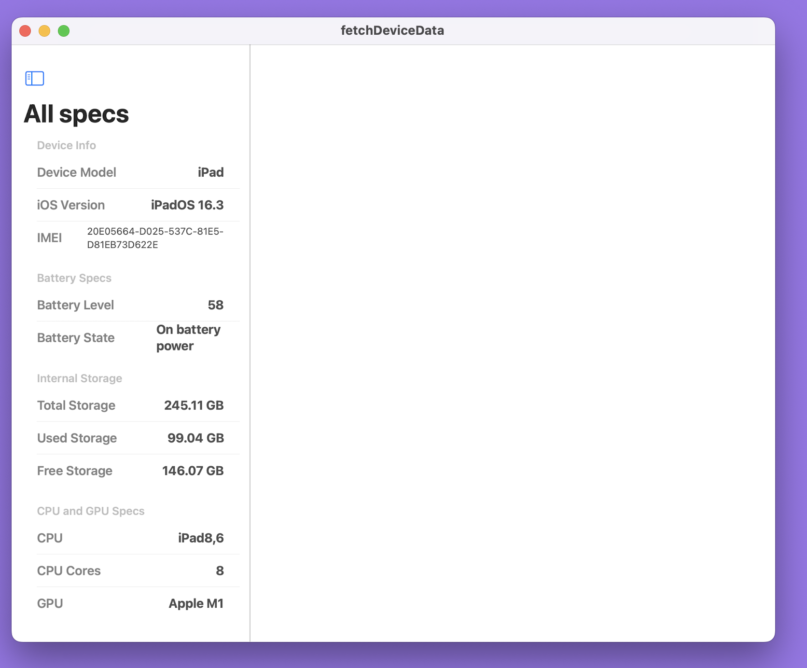

# Device Specs

## Developed an iOS App using Swift and SwiftUI to retrieve following Device/iPhone Information:

- Device Model
- iOS Version
- IMEI (International Mobile Equipment Identity)
- Battery Level (Charge)
- Battery State (On battery 
power, Charging, Full Charge)
- Storage (Total, Used, Free)
- CPU and GPU Specs

